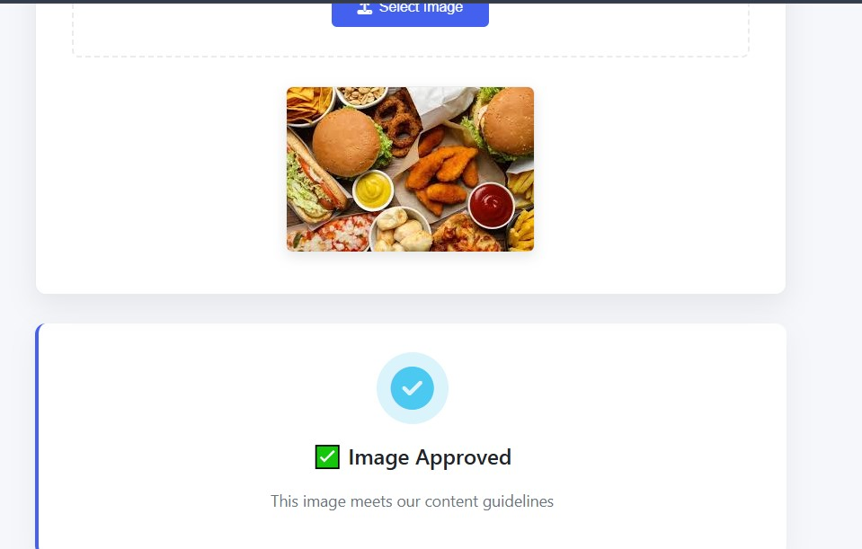
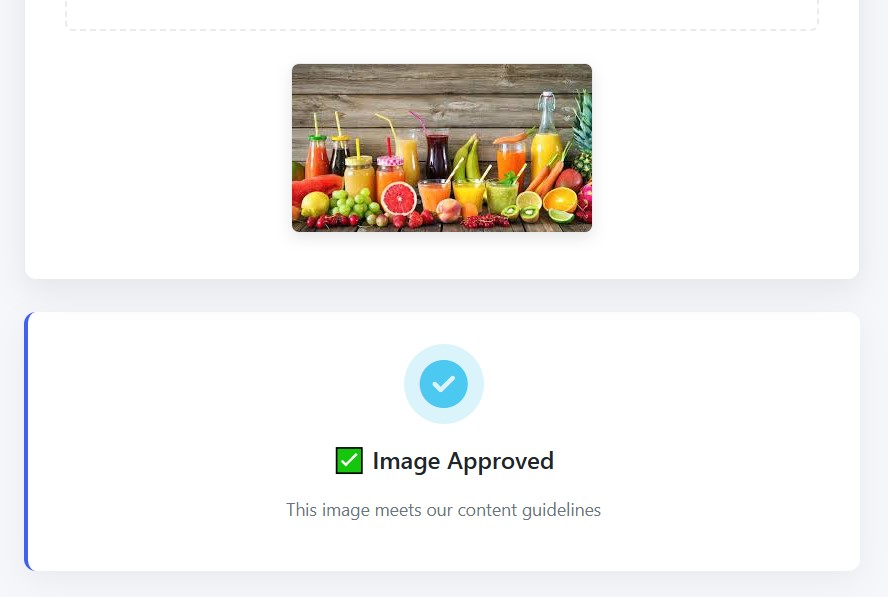
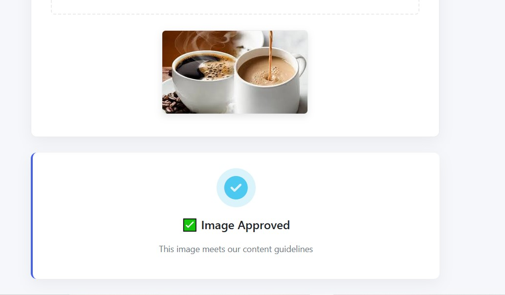
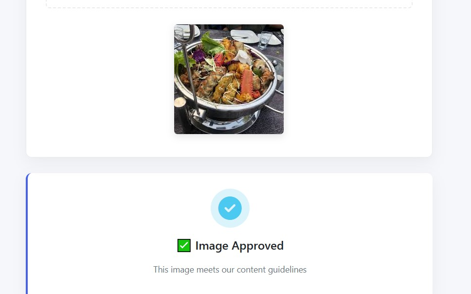
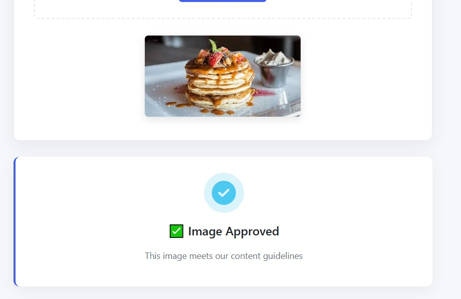
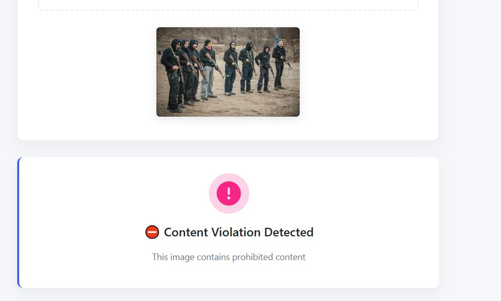
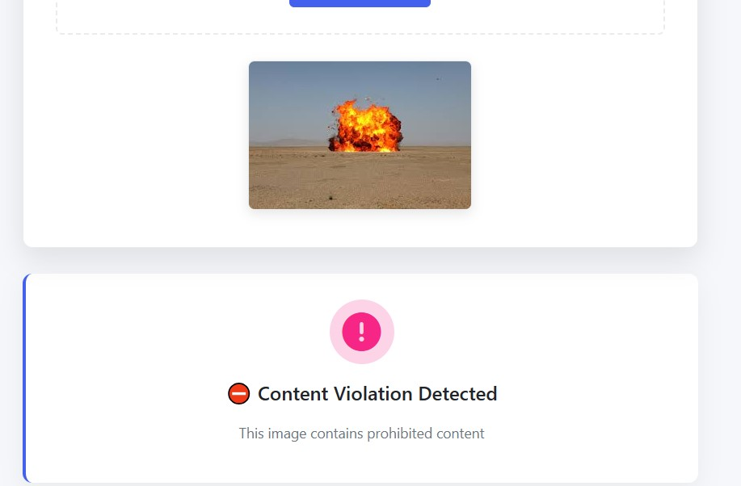
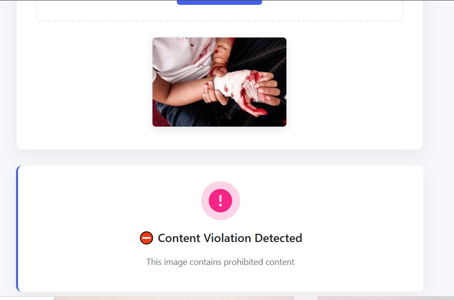
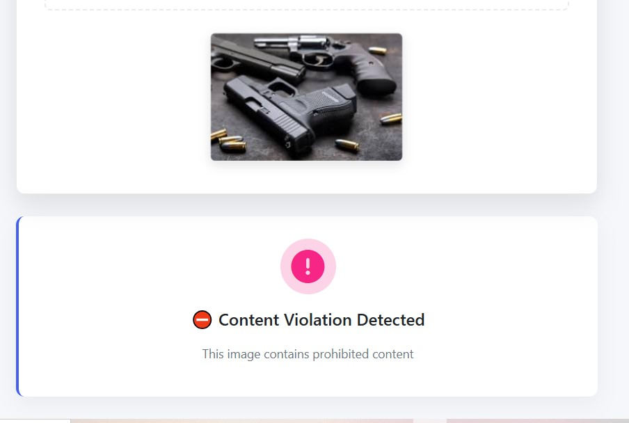

# 🚨 Lean Guard – AI-Based Image Moderator

**Lean Guard** is a powerful AI-driven image moderation system designed to automatically classify uploaded images as **Safe** or **Prohibited**. Leveraging deep learning models, it detects sensitive content such as weapons, gore, and explosives — helping platforms maintain safe and compliant environments.

---
## ⚙️ Tech Stack

- **Frontend**: HTML5, CSS3 (via Flask templating – Jinja2)
- **Backend**: Python 3.10, Flask (micro web framework)
- **Machine Learning**: Keras, TensorFlow, EfficientNet, Custom CNN
- **Deployment**: Localhost (Flask server)
- **Environment**: `venv` (Python virtual environment)
- **Other Tools**: Git, GitHub, Google Colab (for model training and prototyping)

## 🔍 Features

- 🌐 **Interactive Web Interface** for uploading and analyzing images in real-time  
- 🧠 **Deep Learning Models** trained on sensitive content categories  
- ⚡ **Instant Feedback** on whether an image is safe or violates content policy  
- 🔒 **Extendable Architecture** for future authentication, analytics, or cloud integrations  

---

## 🧠 Models Used

The following Keras-based models are integrated into the backend for prediction:

- `best_weapon_model.keras` – Detects the presence of weapons  
- `best_gore_model.keras` – Identifies gory or violent imagery  
- `best_explosive_model.keras` – Recognizes explosives  
- `custom_cnn_model.keras` – Custom-built CNN for benchmarking  
- `efficientnet_model.keras` – Transfer learning using EfficientNet for high accuracy  

---

## 📁 Folder Structure

```text
LEAN_GUARD/
│
├── images_for_testing/       # Sample images for testing
│   ├── safe_samples/         # Approved content examples
│   └── prohibited_samples/   # Restricted content examples
│
├── models/                   # Pretrained Keras models
│   ├── best_explosive_model.keras
│   ├── best_gore_model.keras
│   ├── best_weapon_model.keras
│   ├── custom_cnn_model.keras
│   └── efficientnet_model.keras
│
├── screenshots/              # Application screenshots
│   ├── home.jpg
│   ├── safe_image_result.jpg
│   ├── safe_image_result_2.jpg
│   ├── prohibited_result.jpg
│   └── prohibited_result_2.jpg
│
├── templates/                # Flask templates
│   └── index.html            # Main interface
│
├── venv/                     # Python virtual environment
│
├── app.py                    # Flask application
├── requirements.txt          # Python dependencies
└── README.md                 # Project documentation
```
---


## 🚀 Getting Started

### 1️⃣ Clone the Repository

git clone https://github.com/yourusername/lean_guard.git
cd LEAN_GUARD

 
### 2️⃣ Create a Virtual Environment


python -m venv venv

### Activate the environment:

####  On Windows:


venv\Scripts\activate


#### On Mac/Linux:


source venv/bin/activate


### 3️⃣ Install Dependencies


pip install -r requirements.txt


### 4️⃣ Run the Flask App


python app.py
🔗 The app will be accessible at: http://127.0.0.1:8000

## 💡 How It Works
User uploads an image via the web interface (index.html)

The Flask backend receives and preprocesses the image

The image is passed through the following models:

- 🔫 Weapon detection

- 🩸 Gore detection

- 💣 Explosives detection

If any model flags prohibited content, the image is marked Prohibited

The result is returned to the frontend with dynamic feedback and UI updates

## 🧪 Testing
Use the images for testing/ folder to simulate safe and unsafe inputs. These are example images demonstrating the system’s ability to detect inappropriate content across different classes.

## 🛠 Custom Training (Optional)
To build and use your own models:

Prepare labeled datasets for:

Safe vs Weapon

Safe vs Gore

Safe vs Explosives

Train using Keras (CNN or EfficientNet recommended)

Save models as .keras and place them in the models/ folder


## 🖼️ Screenshots

### 🔹 Home Page

<br>

### 🔹 Safe Image Results

<br>


<br>


<br>


<br>


<br>

### 🔹 Prohibited Image Results

<br>


<br>


<br>




## 👥 Contributors

- [Seemab Hassan](https://www.linkedin.com/in/seemab-hassan-31aaa030a)


## 📄 License
This project is licensed under the MIT License – feel free to use and modify with credit.

## 📌 Future Improvements
User authentication for moderators

Logging and dashboard analytics

Multi-language support

Integration with content management systems or cloud storage
